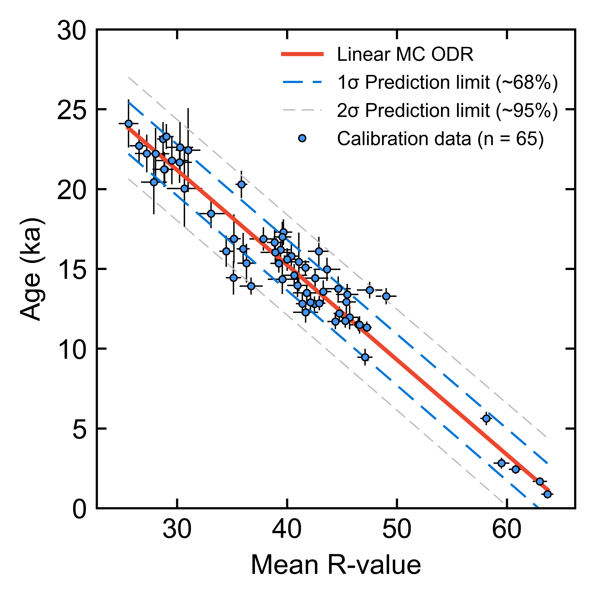
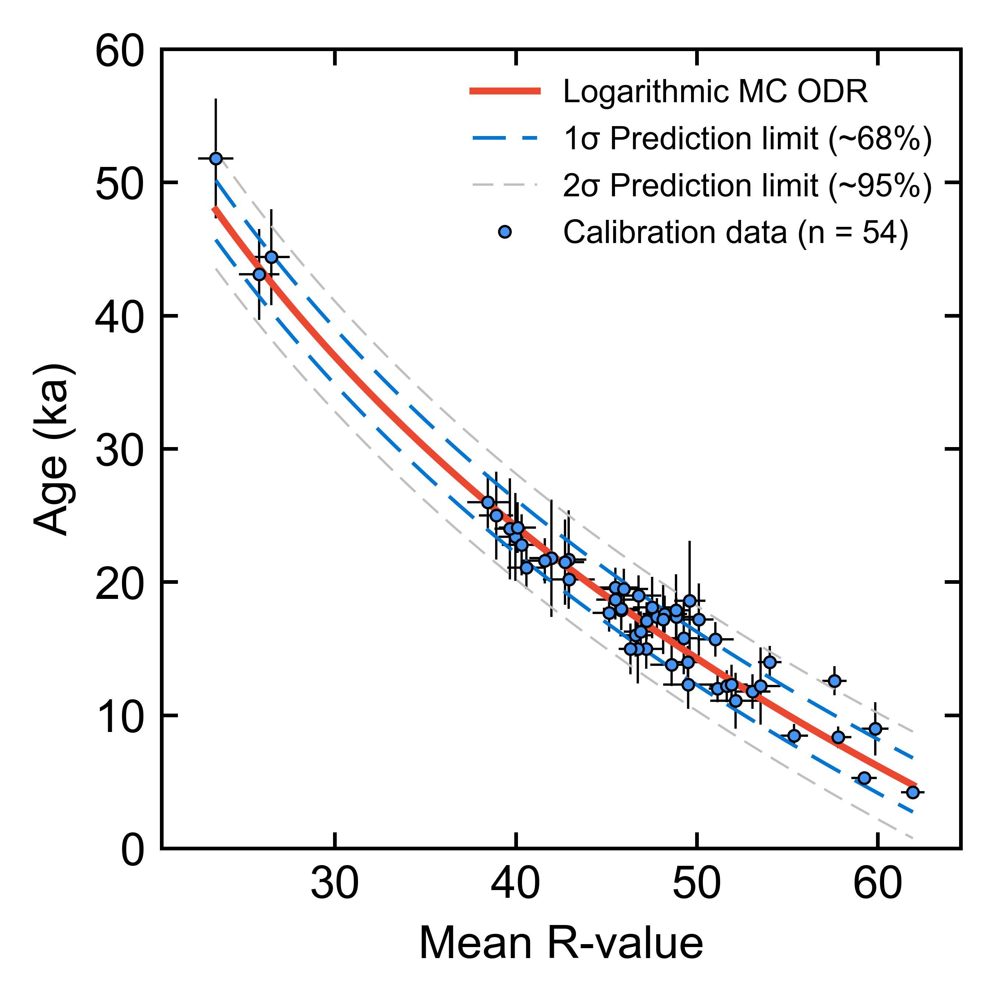

# SHED Earth ([http://shed.earth](http://shed.earth))

This repository comprises the source code for the [shed.earth](http://shed.earth) website (based upon [Django](https://www.djangoproject.com/)). 

**SHED** refers to **Schmidt Hammer Exposure Dating**: a technique that provides a cost-effective solution for dating the exposure of granite surfaces. This can be used to constrain the timing of past events e.g. glacial retreat, which permits a better understanding of the links between climate and landscape evolution. 

The approach is based upon a study by Tomkins et al. (2016), in which a statistically significant relationship was observed between the exposure ages (derived from terrestrial cosmogenic nuclide dating), and Schmidt hammer rebound values (R-values) of 25 granitic surfaces from NW England and Scotland: 

	

These data indicate that granite can weather linearly over significant spatial scales for regions of similar climate and permits the estimation of exposure ages based upon the R-value recorded on the rock. The technique has been demonstrated to be of comparable accuracy to ages derived from terrestrial cosmogenic nuclide dating (Wilson et al. 2019), but without the significant expense that goes along with the use of such techniques, making it useful for researchers and students alike. 

This dataset has recently been updated by Tomkins et al. (2018a), with the inclusion of a further 29 10Be exposure ages, while a new calibration curve has been made available for the Pyrenees (Tomkins et al. 2018b).

	

The **key files** in this repository are:
 
- shedcalc/**schmidt.py**: this file includes the core functions for instrument and age calibration, and age prediction using Monte Carlo orthogonal distance regression (Boggs and Rogers, 1989).    
- shedcalc/**coefficients.py**: this file contains model betas, residuals and covariance matrices for each calibration curve and each production rate. These values are utilised by schmidt.py for calculating ages and predictions limits.
- shedcalc\templates\shedcalc:
	- **index.html**: HTML code for website home page.
	- **results.html**: HTML code for website results page.

## Data availability
	
The underlying 10Be TCN exposure ages and their corresponding Schmidt hammer R-values are available [here](http://huckg.is/shed-earth/Calibration_Summary.csv) for both calibration curves and for a range of production rates.
These include the default globally-calibrated 10Be production rate of Borchers et al. (2016), in addition to locally-calibrated production rates from Loch Lomond (Fabel et al., 2012), Rannoch Moor (Putnam et al., 2019) and Glen Roy (Small and Fabel, 2015). All ages are calculated using the time-independent “Lm” scaling scheme (Lal, 1991; Stone, 2000) and assuming 0 mm ka-1 erosion.

Raw data used for 10Be exposure age calculation are available [here](http://huckg.is/shed-earth/Calibration_CRONUS.csv) in the format required for the CRONUS Earth Web Calculator (Version 2.0; Marrero et al., 2016, available at: http://cronus.cosmogenicnuclides.rocks/2.0/) and [here](http://huckg.is/shed-earth/Calibration_CRONUS.csv) in the format required for the online calculators formerly known as the CRONUS-Earth online calculators (Balco et al., 2008; https://hess.ess.washington.edu/).                    
	                                
## References           

- [Tomkins, M. D., Dortch, J. M., & Hughes, P. D. (2016). Schmidt Hammer exposure dating (SHED): Establishment and implications for the retreat of the last British Ice Sheet. *Quaternary Geochronology*, 33, 46–60.](https://doi.org/10.1016/j.quageo.2016.02.002)
- [Wilson, P., Dunlop, P., Millar, C. and Wilson, F. A. (2019). Age determination of glacially-transported boulders in Ireland and Scotland using Schmidt-hammer exposure-age dating (SHD) and terrestrial cosmogenic nuclide (TCN) exposure-age dating. Quaternary Research, 92(2), 570-582.](https://doi.org/10.1017/qua.2019.12)
- [Tomkins, M. D., Huck, J. J., Dortch, J. M., Hughes, P. D., Kirkbride, M. P. and Barr, I. D. (2018a). Schmidt hammer exposure dating (SHED): calibration procedures, new exposure age data and an online calculator. *Quaternary Geochronology*, pp.55-62.](https://doi.org/10.1016/j.quageo.2017.12.003)
- [Tomkins, M. D., Dortch, J. M., Hughes, P. D., Huck, J. J., Stimson, A. G., Delmas, M., Calvet, M. and Pallàs, R. (2018b). Rapid age assessment of glacial landforms in the Pyrenees using Schmidt hammer exposure dating (SHED). Quaternary Research, 90(1), 26-37.](https://doi.org/10.1017/qua.2018.12)
- [Boggs, P. T., Rogers, J.E. (1990). Orthogonal distance regression, in: “Statistical Analysis of Measurement Error Models and Applications: Proceedings of the AMS-IMS-SIAM Joint Summer Research Conference Held June 10-16, 1989.”](https://doi.org/10.6028/nist.ir.89-4197)
- [Borchers, B., Marrero, S., Balco, G., Caffee, M., Goehring, B., Lifton, N., Nishiizumi, K., Phillips, F., Schaefer, J. and Stone, J. (2016). Geological calibration of spallation production rates in the CRONUS-Earth project. *Quaternary Geochronology*, 31, 188-198.](https://doi.org/10.1016/j.quageo.2015.01.009)
- [Fabel, D., Ballantyne, C.K. and Xu, S. (2012). Trimlines, blockfields, mountain-top erratics and the vertical dimensions of the last British–Irish Ice Sheet in NW Scotland. *Quaternary Science Reviews*, 55, 91-102.](https://doi.org/10.1016/j.quascirev.2012.09.002)
- [Putnam, A.E., Bromley, G.R., Rademaker, K. and Schaefer, J.M. (2019). In situ 10Be production-rate calibration from a 14C-dated late-glacial moraine belt in Rannoch Moor, central Scottish Highlands. *Quaternary Geochronology*, 50, 109-125.](https://doi.org/10.1016/j.quageo.2018.11.006)
- [Small, D. and Fabel, D. (2015). A Lateglacial 10Be production rate from glacial lake shorelines in Scotland. *Journal of Quaternary Science*, 30(6), 509-513.](https://doi.org/10.1002/jqs.2804)
- [Lal, D. (1991). Cosmic ray labeling of erosion surfaces: in situ nuclide production. *Earth and Planetary Science Letters*, 104, 424-439.](https://doi.org/10.1016/0012-821X(91)90220-C)
- [Stone, J.O. (2000). Air pressure and cosmogenic isotope production. *Journal of Geophysical Research: Solid Earth*, 105(B10), 23753-23759.](https://doi.org/10.1029/2000JB900181)
- [Marrero, S.M., Phillips, F.M., Borchers, B., Lifton, N., Aumer, R. and Balco, G. (2016). Cosmogenic nuclide systematics and the CRONUScalc program. *Quaternary Geochronology*, 31, 160-187.](https://doi.org/10.1016/j.quageo.2015.09.005)
- [Balco, G., Stone, J.O., Lifton, N.A. and Dunai, T.J. (2008). A complete and easily accessible means of calculating surface exposure ages or erosion rates from 10Be and 26Al measurements. *Quaternary Geochronology*, 3(3), 174-195.](https://doi.org/10.1016/j.quageo.2007.12.001)