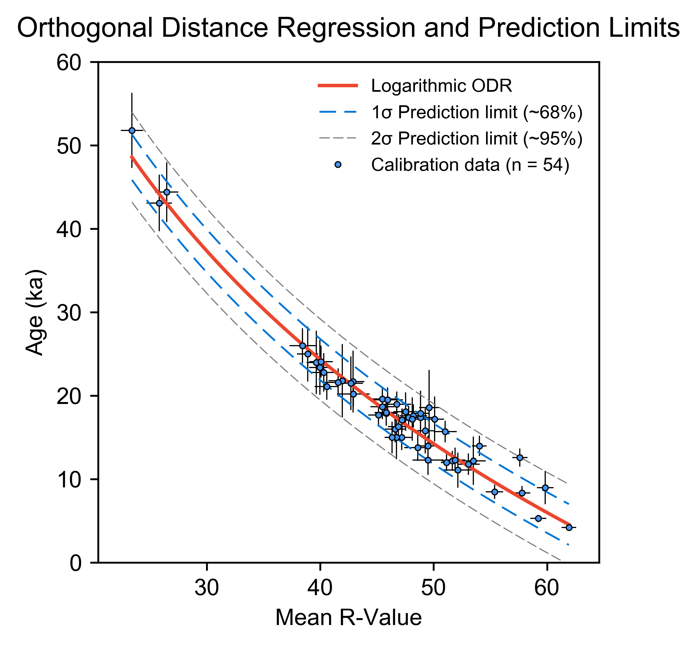

# SHED Earth ([http://shed.earth](http://shed.earth))

This repository comprises the source code for the [shed.earth](http://shed.earth) website (based upon [Django](https://www.djangoproject.com/)). 

**SHED** refers to **Schmidt Hammer Exposure Dating**: a technique that provides a cost-effective solution for dating the exposure of granite surfaces. This can be used to constrain the timing of past events e.g. glacial retreat, which permits a better understanding of the links between climate and landscape evolution. 

The approach is based upon a study by Tomkins et al. (2016), in which a statistically significant relationship was observed between the exposure ages (derived from terrestrial cosmogenic nuclide dating), and Schmidt hammer rebound values (R-values) of 25 granitic surfaces from NW England and Scotland: 

	

These data indicate that granite can weather linearly over significant spatial scales for regions of similar climate and permits the estimation of exposure ages based upon the R-value recorded on the rock. The technique has been demonstrated to be of comparable accuracy to ages derived from terrestrial cosmogenic nuclide dating (Wilson et al. 2019), but without the significant expense that goes along with the use of such techniques, making it useful for researchers and students alike. 

This dataset has recently been updated by Tomkins et al. (2018a), with the inclusion of a further 29 10Be exposure ages, while a new calibration curve has been made available for the Pyrenees (Tomkins et al. 2018b).

	

The **key files** in this repository are:

- **data** folder: this includes the 10Be TCN exposure ages and their corresponding Schmidt hammer R-values. These data are used for calibration curve construction.
- shedcalc/**schmidt.py(*: this file includes the core functions for instrument and age calibration, and calibration curve construction (*fitLineGB*, *fitLinePY*) using orthogonal distance regression (Boggs and Rogers, 1989).    
- shedcalc\templates\shedcalc:
	- **index.html**: HTML code for website home page.
	- **results.html**: HTML code for website results page.
	
## References

- [Tomkins, M. D., Dortch, J. M., & Hughes, P. D. (2016). Schmidt Hammer exposure dating (SHED): Establishment and implications for the retreat of the last British Ice Sheet. *Quaternary Geochronology*, 33, 46–60.](https://doi.org/10.1016/j.quageo.2016.02.002)
- [Wilson, P., Dunlop, P., Millar, C. and Wilson, F. A. (2019). Age determination of glacially-transported boulders in Ireland and Scotland using Schmidt-hammer exposure-age dating (SHD) and terrestrial cosmogenic nuclide (TCN) exposure-age dating. Quaternary Research, 92(2), 570-582.](https://doi.org/10.1017/qua.2019.12)
- [Tomkins, M. D., Huck, J. J., Dortch, J. M., Hughes, P. D., Kirkbride, M. P. and Barr, I. D. (2018a). Schmidt hammer exposure dating (SHED): calibration procedures, new exposure age data and an online calculator. *Quaternary Geochronology*, pp.55-62.](https://doi.org/10.1016/j.quageo.2017.12.003)
- [Tomkins, M. D., Dortch, J. M., Hughes, P. D., Huck, J. J., Stimson, A. G., Delmas, M., Calvet, M. and Pallàs, R. (2018b). Rapid age assessment of glacial landforms in the Pyrenees using Schmidt hammer exposure dating (SHED). Quaternary Research, 90(1), 26-37.](https://doi.org/10.1017/qua.2018.12)
- [Boggs, Paul T., Rogers, J.E. (1990). Orthogonal distance regression, in: “Statistical Analysis of Measurement Error Models and Applications: Proceedings of the AMS-IMS-SIAM Joint Summer Research Conference Held June 10-16, 1989,.”](https://doi.org/10.6028/nist.ir.89-4197)